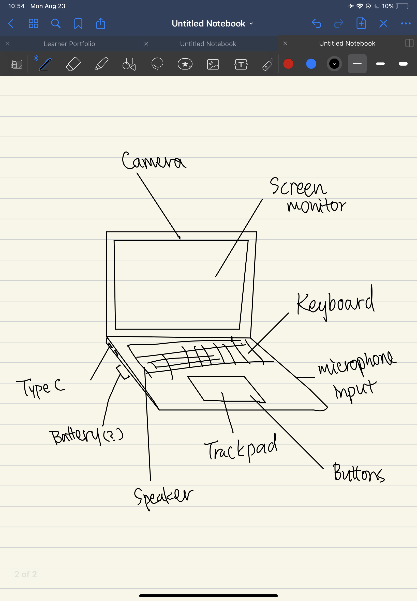

# Lesson No. 2: working with githubmarkdown files

A markdown file is a text file with special formating. these files have extension .md

#My first picture of the computer

Fig. 1 My first try at drawing a computer

In **Fig 1** i tired to draw a computer and i included only a cardboard box. 
